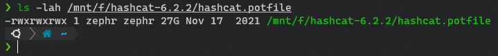

# PotFileUtils
This repo contains various utilities for manipulating the potfile in hashcat; the first two are for mapping the $HEX[] values to actual words. The second will parse your potfile and output to a wordlist. 

Inspired by a few utils that [John Carroll](https://twitter.com/TheContractorio) wrote in go initially.

## Modes
1. pot2words - Reads an input file where each line is separated by ":", and writes the last field of each line to the output file.

2. hex2words - Reads a potfile where hexadecimal strings are found in the second field of each line, separated by ":", decodes the hexadecimal strings into plain text, and writes the decoded strings to the output file.

3. both - Runs the pot2words and hex2words modes and writes the combined output to the output file. This mode also removes duplicates from the output.

## Usage
```
python PotUtils.py --mode [MODE] --input [Potfile or path to potfile] --output [OUTPUT_FILE_PATH] --threads <number of threads>
```
Tested on a 27GB Potfile, and while it takes a wee bit of time with threading, it runs!


### Example
```
python PotUtils.py --mode pot2words --input input.txt --output output.txt --threads 10
python PotUtils.py --mode hex2words --input potfile.txt --output output.txt --threads 10
python PotUtils.py --mode both --input input.txt --output output.txt --threads 10
```
When it uses threads in either pot2words or hex2words, the script will create X number of temporary files i.e. 1 per thread, then merge them at the end. When using both mode, it'll do the same but merge all the outputs into one file.

## Future Plans
- Add progress bar
- Add more utils
- Add checks for space on the disk before splitting a file
- Add colouring to the script
